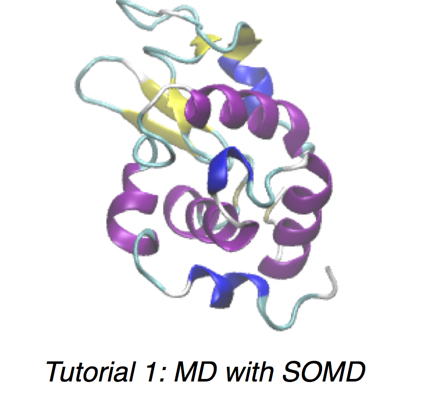
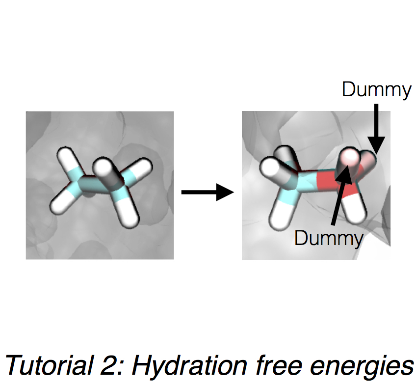

#
 SOMD Tutorials
 
The set of tutorials below will guide the user to setup up and familiarise themselves with running molecular dynamics simulations using the Sire app `somd`. 

`somd` is a powerful tool that allows the user to run simple molecular dynamics simulations to more complex relative or absolute free energy calculations. 

&nbsp;
&nbsp;
&nbsp;

 

&nbsp;
&nbsp;
&nbsp;

&nbsp;
&nbsp;
&nbsp;

### Installation Instructions
If you are having problems with the installation of SOMD as part of the Sire molecular library please read the installation instructions carefully, which can be found [here](Installation.md).