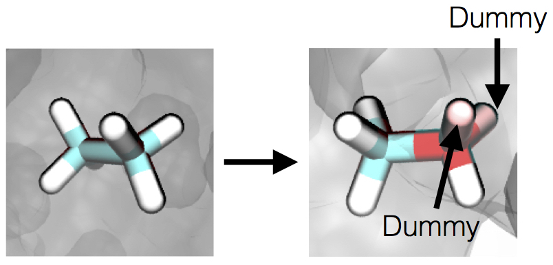

#
 Computing the relative hydration free energy of ethane and methanol

__
 Antonia Mey 
__

 School of Chemistry 

 University of Edinburgh 

  

This tutorial will cover how an alchemical free energy calculation works and how to use Sire to compute the relative free energy of hydration of ethane and methanol. 
If you have never used Sire before, it might be worth while to first try the molecular dynamics [tutorial](Tutorial1.md).

__
[Start tutorial](Hydration_free_energy/FESetup.md)
__